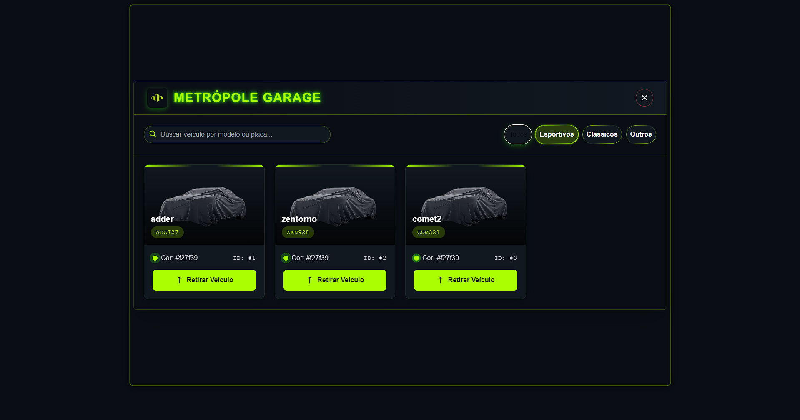

# 🏎️ Metropole Garage | Sistema de Garagem FiveM

<div align="center">
  
  <br/>
  <p><strong>Sistema de garagem para o servidor Metrópole RP</strong></p>
  <hr/>
</div>

## 📌 Visão Geral

O **Metropole Garage** é um sistema avançado de gerenciamento de veículos para servidores FiveM.

<div align="center">
  
</div>

### ✨ Características Principais

- 🚗 **Interface moderna e intuitiva** desenvolvida com React e TailwindCSS
- 🔄 **Persistência completa de dados** para seus veículos no MySQL
- 🎨 **Preservação de customizações** (cores, mods, upgrades) entre sessões
- 🛡️ **Sistema de proteção contra duplicação** utilizando StateBags
- 🧩 **Independente de frameworks** - funciona em qualquer servidor FiveM
- 👮 **Comandos administrativos** para gerenciar veículos com facilidade
- 🔧 **Código limpo e documentado** utilizando TypeScript e práticas modernas

## 💻 Stack Tecnológica

<table>
  <tr>
    <td><strong>Frontend</strong></td>
    <td>React • TypeScript • TailwindCSS • Vite</td>
  </tr>
  <tr>
    <td><strong>Backend</strong></td>
    <td>TypeScript • Lua (FiveM)</td>
  </tr>
  <tr>
    <td><strong>Persistência</strong></td>
    <td>MySQL (via oxmysql)</td>
  </tr>
  <tr>
    <td><strong>Estado</strong></td>
    <td>StateBags (nativo do FiveM)</td>
  </tr>
  <tr>
    <td><strong>Permissões</strong></td>
    <td>Sistema ACE nativo do FiveM</td>
  </tr>
</table>

## 🗂️ Estrutura do Projeto

```
/client           # Interface React e código cliente
  /components     # Componentes React
  /nui            # Integração NUI com FiveM
  /src            # Código fonte principal
  /public         # Arquivos estáticos

/server           # Lógica do servidor
  /src            # TypeScript para backend
  events.lua       # Integração Lua para eventos de veículos
```

## ⚙️ Instalação

### Pré-requisitos
- Servidor FiveM atualizado
- MySQL/MariaDB
- Node.js v18+ (para desenvolvimento)
- Resource `oxmysql` instalada e funcionando

### Passos para Instalação

1. Instalar Frontend
 ```
cd metropole-garage/client
npm install
npm run build
```

2. Instalar  Backend
```
cd metropole-garage/server
npm install
npm run build
```

3. Configure o arquivo server.cfg:
   ```cfg
   ensure oxmysql
   ensure metropole-garage
   
   # Permissões administrativas
   add_ace group.admin metropolegarage.admin allow
   add_principal identifier.[STEAM_ID] group.admin
   ```

## 🎮 Comandos e Utilização

| Comando | Descrição | Permissão |
|---------|-----------|-----------|
| `/garage` | Abre a interface da garagem | Qualquer jogador |
| `/car [placa]` | Spawn de veículo via placa | metropolegarage.admin |
| `/car [modelo]` | Spawn direto pelo modelo | metropolegarage.admin |

### Fluxo do usuário:
1. Digite `/garage` para abrir a interface
2. Visualize todos os seus veículos salvos
3. Clique em "Retirar" para spawnar um veículo
4. Para guardar, use o botão "Guardar" quando próximo do veículo

## 🧠 Características Avançadas

- **Prevenção de duplicação**: Sistema inteligente que impede a duplicação de veículos usando StateBags
- **Persistência de customizações**: Cores primárias/secundárias e modificações são salvas e restauradas
- **Sistema de erros**: Feedback claro sobre problemas como veículos já spawnados
- **Código modular**: Fácil adaptação para diferentes servidores

## 🔍 Solução de Problemas

- **Veículos não aparecem?** Verifique se o oxmysql está funcionando e se o banco de dados está corretamente configurado
- **Erros de permissão?** Verifique se as ACEs estão configuradas corretamente no server.cfg
- **Problemas com a interface?** Certifique-se de que o build do React foi gerado corretamente

## 🎥 Demonstração

[Assista ao vídeo de demonstração](https://www.youtube.com/watch?v=498u_1T9ibQ) para ver o sistema em funcionamento.

---

<div align="center">
  <p>Desenvolvido por <b>João Luiz</b> para o servidor Metrópole RP</p>
</div>
